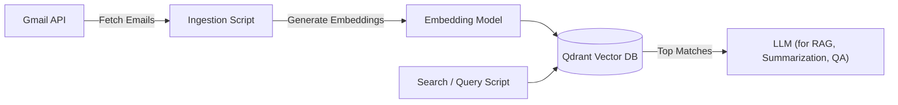

# Multi-Source AI-Powered Search Engine

## Project Summary

This project is an **AI-powered, multi-source search engine** designed to index and search through personal and organizational content across multiple platforms. While the current prototype focuses on **Gmail email indexing**, the architecture is deliberately built to support **multiple data sources** such as:

- Gmail and other email providers
- Google Drive, Dropbox, OneDrive
- Local file systems
- Slack, Notion, Confluence, Jira, and other SaaS tools

The ultimate goal is to create a **single, intelligent search layer** that can query all your content—whether it’s in the cloud or on your machine—using **natural language queries**.

## Goals

1. **Unified Search Across Platforms**
   Bring together emails, documents, chat logs, and other content into a single searchable interface.

2. **Intelligent Contextual Search**
   Use **embeddings** and **Retrieval-Augmented Generation (RAG)** to retrieve the most relevant results, even when the search terms don’t match the exact text.

3. **Extendability**
   Architect the system so that new connectors (e.g., Slack, Notion) can be easily added.

4. **Local Control & Privacy**
   Run entirely locally (or in your own private cloud), so your data never leaves your control.

## Current Architecture

The current implementation consists of:

- **Gmail Connector (Python)**
  Uses the Google Gmail API to fetch emails and their metadata.

- **Embeddings Generator**
  Uses a local or cloud-based embedding model to convert email content into vector representations.

- **Vector Database (Qdrant)**
  Stores embeddings for fast similarity search.

- **Search & Retrieval API**
  Queries Qdrant for relevant content and (in future) uses a local LLM for summarization and question answering.



## Planned Features

- **Multiple Connectors**: Add support for Google Drive, Dropbox, Slack, etc.
- **Incremental Sync**: Avoid re-downloading unchanged data.
- **Local LLM Integration**: Use models like LLaMA, Mistral, or Mixtral for summarization & reasoning.
- **Web-based UI**: A simple browser-based search interface.
- **Query Understanding**: Support semantic and keyword search.

## Tech Stack

- **Python 3.10+**
- **Docker & Docker Compose**
- **Qdrant** for vector search
- **SentenceTransformers** or OpenAI embeddings
- **Google Gmail API**
- **Local LLMs** via Ollama or llama.cpp (planned)

## Status

Currently, the system can:

- Connect to Gmail via OAuth2
- Fetch and store messages
- Generate embeddings
- Store them in Qdrant
- Query and retrieve relevant matches

This will be expanded to cover other services and integrate RAG workflows.

---

## License

MIT License — you are free to use, modify, and distribute with attribution.


# Setup

## Start Qdrant in Docker
Qdrant is our local vector DB. Easiest way to run it:

```bash
docker run -d \
  --name qdrant \
  -p 6333:6333 \
  qdrant/qdrant
```

Verify it’s up:

```bash
curl http://localhost:6333/collections
```

You should get {"collections": []}.


## Create Google Cloud project & enable Gmail API

We need OAuth credentials for Gmail access.


Option 1:

- Go to Gmail API Quickstart page for Python:
https://developers.google.com/gmail/api/quickstart/python

- Click Enable the Gmail API — it will spin up a temporary Google Cloud project in your personal Google account, no billing needed.

- It will immediately download a credentials.json for you.

- That file works the same way as before in the InstalledAppFlow.

- This bypasses the “account closed” message because it uses a free-tier API project.

Option 2:

- Go to: https://console.cloud.google.com/

- Create a new project (e.g., gmail-search-llm)

- Enable Gmail API

- Go to APIs & Services → Credentials

- Click Create credentials → OAuth client ID

- Application type: Desktop App

- Name: Local Dev Gmail

- Download the JSON — rename it to credentials.json in your project folder.
